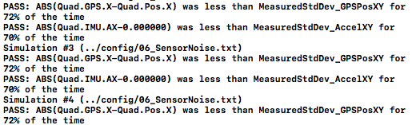
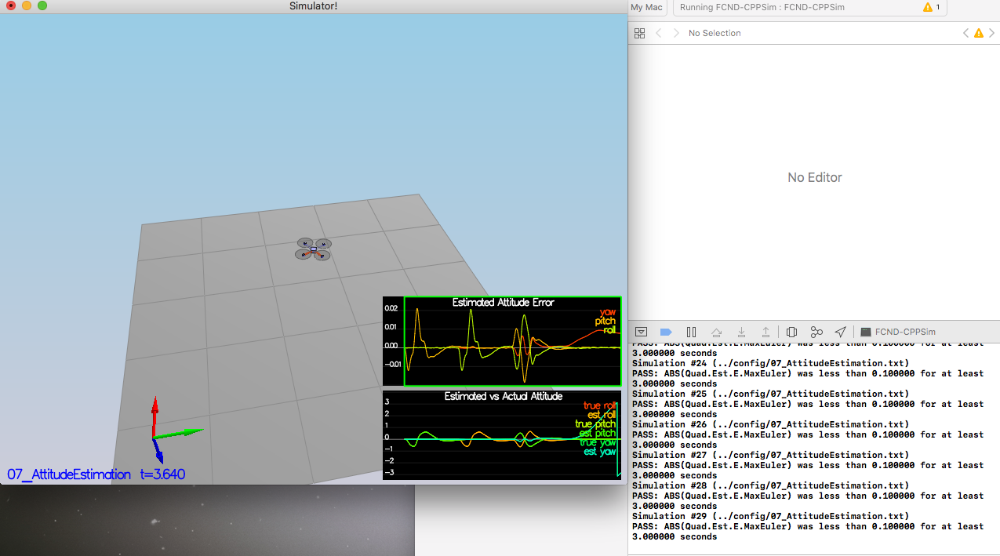

# Estimation Project #

In this project, I will be developing the estimation portion of the controller used in the CPP simulator to deal with noisy sensor measurements. The Gyro, IMU, GPS and Magnetometer measurements are added progressively in each step to get an estimate of position, velocity and yaw.

# Requirements #
1. Clone the repository.
2. Implement the `predict` and `update` steps to meet the rubrics.
3. Tune the estimator and (if necessary) re tune the controller to successfully fly the quad in as required in Scenario 11.

### Project Structure ###

 - The EKF is implemented in `QuadEstimatorEKF.cpp`

 - Parameters for tuning the EKF are in the parameter file `QuadEstimatorEKF.txt`
 
 - Configuration of the controller is in `QuadControlParams.txt`
 
 - Controller code is in `QuadControl.cpp`
 
 - `Quad.GPS.X` measurements are in `Graph1.txt`
 - `Quad.IMU.accelX` measurements are in `Graph2.txt`
 
 - Sensor noise with the measurement standard deviation of X and acceleration is in `06_SensorNoise.txt`
 
## The Tasks ##

### Step 1: Sensor Noise ###

### Step 2: Attitude Estimation ###

### Step 3: Prediction Step ###

### Step 4: Magnetometer Update ###

### Step 5: Closed Loop + GPS Update ###

### Step 6: Adding Your Controller ###

## Authors ##

Thanks to Fotokite for the initial development of the project code and simulator.
