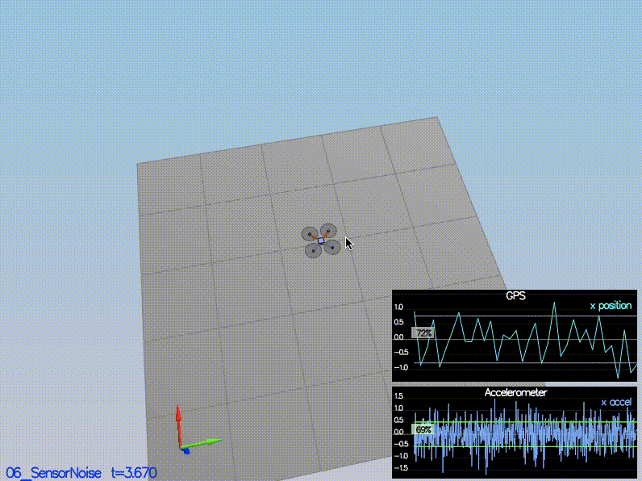

# Estimation Project #

In this project, I will be developing the estimation portion of the controller used in the CPP simulator to deal with noisy sensor measurements. The Gyro, IMU, GPS and Magnetometer measurements are added progressively in each step to get an estimate of position, velocity and yaw.

# Requirements #
1. Clone the repository.
2. Implement the `predict` and `update` steps to meet the rubrics.
3. Tune the estimator and (if necessary) re tune the controller to successfully fly the quad in as required in Scenario 11.

### Project Structure ###

 - The EKF is implemented in `QuadEstimatorEKF.cpp`

 - Parameters for tuning the EKF are in the parameter file `QuadEstimatorEKF.txt`
 
 - Configuration of the controller is in `QuadControlParams.txt`
 
 - Controller code is in `QuadControl.cpp`
 
 - `Quad.GPS.X` measurements are in `Graph1.txt`
 - `Quad.IMU.accelX` measurements are in `Graph2.txt`
 
 - Sensor noise with the measurement standard deviation of X and acceleration is in `06_SensorNoise.txt`
 
## The Tasks ##

### Step 1: Sensor Noise ###

### Step 2: Attitude Estimation ###

### Step 3: Prediction Step ###

### Step 4: Magnetometer Update ###

### Step 5: Closed Loop + GPS Update ###

### Step 6: Adding Your Controller ###

## Writeup
### Provide a Writeup / README that includes all the rubric points and how you addressed each one. You can submit your writeup as markdown or pdf.

The writeup is this README.md which you are reading.

## Implement Estimator

### Determine the standard deviation of the measurement noise of both GPS X data and Accelerometer X data.
From the `Graph1.txt` and `Graph2.txt` files, we have the standard deviation calculated. Those values can be found in the first two rows of the `06_SensorNoise.txt` file in the config directory. 
-MeasuredStdDev_GPSPosXY = 0.776012216
-MeasuredStdDev_AccelXY = 0.514036636

### Implement a better rate gyro attitude integration scheme in the `UpdateFromIMU()` function.

### Implement all of the elements of the prediction step for the estimator.

### Implement the magnetometer update.

### Implement the GPS update.

## Flight Evaluation ##

The quad meets the required rubric criteria as can be seen from the above GIFs and the corresponding green boxes to signnify meeting the required criteria

## Authors ##

Thanks to Fotokite for the initial development of the project code and simulator.
